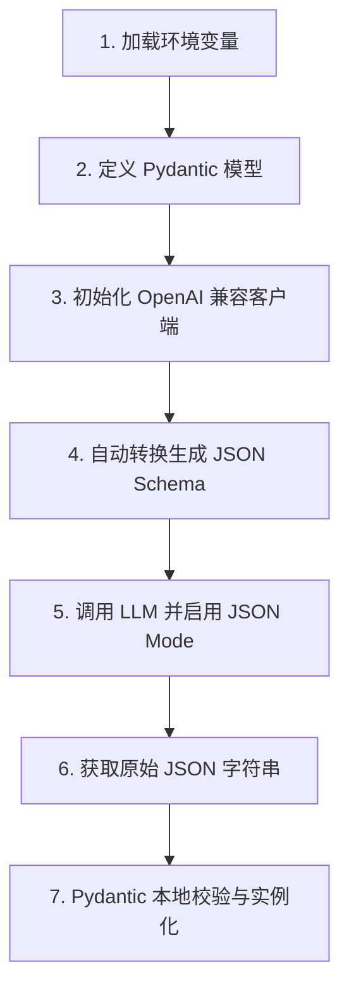

# AI 结构化工程信息提取工作流项目教程 🏗️

本教程旨在帮助初学者了解如何利用大语言模型 (LLM) 配合 Pydantic，从非结构化的自然语言文本中稳定、安全地提取结构化 JSON 数据。

---

## 📖 项目概述 (Overview)
在实际生产中，大模型生成的输出往往难以预测，容易产生“幻觉”或者返回不合规的格式（如把 JSON 包裹在 Markdown 代码块中）。

本项目的目的是通过**大模型 JSON 模式 (JSON Mode)** 与 **Pydantic 本地校验** 的双重保障，实现一个健壮的提取流程。我们可以将一段包含建筑工程描述的自然段落，稳定地转换为符合我们预定格式的 Python 对象或标准 JSON。

---

## 🛠️ 环境准备与安装 (Setup Instructions)

### 1. 前置要求 (Prerequisites)
- 安装 Python 3.12 或更高版本。
- 使用 `uv` 包管理工具（推荐）或标准 `pip`。

### 2. 安装依赖 (Dependencies)
项目所需的库已在 `pyproject.toml` 中声明：
- `fastapi`: 准备用于未来扩展的 Web 框架。
- `openai`: 用于与大模型通信（这里使用了 OpenAI 兼容的 DeepSeek API）。
- `pydantic`: 数据验证与解析核心库。
- `python-dotenv`: 自动加载 `.env` 环境变量文件。

使用以下命令安装依赖：
```bash
# 如果使用 uv
uv sync

# 如果使用标准 pip
pip install -r requirements.txt
```

### 3. 配置密钥 (Configuration)
1. 复制项目根目录下的 `.env.example` 并重命名为 `.env`。
2. 在 `.env` 中填写您的大模型密钥和对应的 API 接口地址：
   ```env
   OPENAI_API_KEY=your_real_api_key_here
   OPENAI_BASE_URL=https://api.deepseek.com
   ```
   *(注意：`.env` 文件包含敏感凭证，已被加入到 `.gitignore` 中，绝对不要提交到 GitHub)*

---

## 🧩 核心代码原理解析 (How It Works)

整个提取流程在 [main.py](file:///d:/PyProjects/ai-workflow/main.py) 中实现，可以划分为 7 个关键步骤：



### 详细步骤说明：
1. **环境变量加载**：利用 `python-dotenv` 读取本地的 `.env` 配置文件，保护密钥安全。
2. **定义 Pydantic 数据模型 (`ProjectInfo`)**：
   * 每一个需要提取的字段都在 `ProjectInfo` 类中被显式声明。
   * 通过 `Field(description="...")` 描述字段的业务定义。**描述信息非常重要**，因为它会被用作给大模型的提示词。
   * 设置 `default=None` 的可选字段（如地上/地下层数），确保字段缺失时程序不会崩溃，而是返回 `None`。
3. **初始化客户端**：使用兼容 OpenAI 格式的客户端，指向我们预设的 API 地址。
4. **生成 JSON Schema**：
   * 通过 `ProjectInfo.model_json_schema()` 自动从代码中的类定义生成工业标准的 JSON Schema 规范。这比手写提示词更精确、更符合大模型偏好。
5. **调用大模型接口**：
   * 将 JSON Schema 嵌入 System Message 中，命令大模型提取数据。
   * 启用 `response_format={"type": "json_object"}` (JSON 模式)，强制大模型只输出标准 JSON。
6. **接收原始响应**：获取模型吐出的原生字符串。
7. **Pydantic 本地校验**：
   * 即使大模型生成了标准 JSON，它的字段类型仍可能有幻觉（例如将建筑面积的 `float` 返回成了 `"32500平方米"` 字符串）。
   * `ProjectInfo.model_validate_json()` 会在本地进行类型断言和校验，确保数据清洗干净后才流入后续的业务逻辑。

---

## 🚀 运行示例 (Example Usage)
在终端中执行以下命令即可启动提取流程：
```bash
python main.py
```

---

## 📋 样例输出 (Sample Output)
运行成功后，终端将输出如下内容：

```text
正在向大语言模型请求结构化提取数据...

👉 大模型返回的原始 JSON 字符串:
{
  "project_name": "合肥高新区创新产业园三期A1栋研发楼建设项目",
  "location": "合肥市蜀山区",
  "total_area_sqm": 32500.5,
  "floors_above_ground": null,
  "floors_underground": null,
  "structural_type": "现浇钢筋混凝土剪力墙结构"
}

🎉 --- 提取结果校验成功 ---
项目名称: 合肥高新区创新产业园三期A1栋研发楼建设项目
建设地点: 合肥市蜀山区
建筑面积: 32500.5 ㎡
地上/地下层数: 地上 None 层 / 地下 None 层
结构形式: 现浇钢筋混凝土剪力墙结构
```
